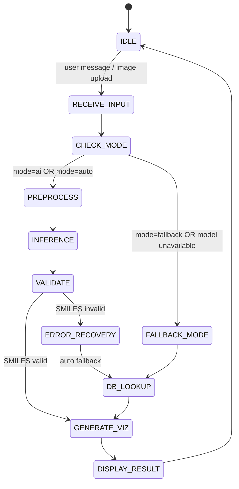

# Etapa 4 -- Arhitectura Sistemului Inteligent Artificial (SIA)

**Proiect:** ChemNet-Vision
**Disciplina:** Retele Neuronale
**Institutie:** POLITEHNICA Bucuresti -- FIIR
**Student:** Alexandru Gabriel
**Data:** 2026-02-11

---

## 1. Prezentare generala

ChemNet-Vision este un sistem inteligent artificial pentru identificarea si analiza moleculelor chimice. Sistemul primeste un query (text sau imagine) si returneaza informatii structurate despre molecula identificata: formula chimica, greutatea moleculara, sinonime si vizualizare 2D/3D.

Arhitectura este modulara, compusa din trei module principale, un model multimodal de inferenta si un model NLP auxiliar.

---

## 2. Module principale

### 2.1. Modul 1 -- Data Logging (Logarea si preprocesarea datelor)

| Componenta          | Locatie              |
| ------------------- | -------------------- |
| Scripturi utilitare | `scripts/`           |
| Preprocesare        | `src/preprocessing/` |

**Responsabilitati:**

- Descarcarea si curatarea datelor din ChEMBL.
- Validarea SMILES cu RDKit.
- Calculul descriptorilor moleculari (10 features RDKit).
- Normalizare, codificare, imputare, capping outlieri.
- Generarea setului de date procesat (`data/processed/molecules_processed.csv`).

### 2.2. Modul 2 -- Reteaua Neurala (Neural Network)

| Componenta         | Locatie     |
| ------------------ | ----------- |
| Model si antrenare | `ai_model/` |

**Responsabilitati:**

- Definirea arhitecturii modelului multimodal (CNN + MLP + GNN + LSTM).
- Definirea modelului NLP auxiliar.
- Antrenarea, validarea si salvarea checkpoint-urilor.
- Generarea metricilor de performanta.

### 2.3. Modul 3 -- Web Service si Interfata Utilizator (UI)

| Componenta          | Locatie    |
| ------------------- | ---------- |
| Backend (Flask API) | `backend/` |
| Frontend (React)    | `src/app/` |

**Responsabilitati:**

- API REST pentru inferenta (endpoint `/api/chat`).
- Gestionarea celor 3 moduri de operare: `ai`, `fallback`, `auto`.
- Interfata de chat interactiva (React).
- Afisare vizualizari moleculare 2D/3D.

---

## 3. State Machine (Masina de stari)

Fluxul de executie al sistemului este modelat printr-o masina de stari cu urmatoarele tranzitii:

```
IDLE -> RECEIVE_INPUT -> CHECK_MODE -> PREPROCESS -> INFERENCE -> VALIDATE -> GENERATE_VIZ -> DISPLAY_RESULT
```

### 3.1. Diagrama Mermaid



### 3.2. Descrierea starilor

| Stare              | Descriere                                                               |
| ------------------ | ----------------------------------------------------------------------- |
| **IDLE**           | Asteptare input utilizator                                              |
| **RECEIVE_INPUT**  | Preluare query text sau imagine incarcata                               |
| **CHECK_MODE**     | Selectare mod operare (AI / Fallback / Auto) si verificare checkpoint   |
| **PREPROCESS**     | Transformari imagine (resize 224x224, normalizare) + pregatire features |
| **INFERENCE**      | Executie inferenta prin reteaua neurala (CNN+MLP+GNN -> Fusion -> LSTM) |
| **VALIDATE**       | Validare SMILES generat cu RDKit                                        |
| **ERROR_RECOVERY** | Tratare SMILES invalid, redirectare spre DB lookup                      |
| **DB_LOOKUP**      | Cautare in baza de date locala (fallback)                               |
| **GENERATE_VIZ**   | Generare vizualizare 2D/3D cu RDKit pentru molecula identificata        |
| **DISPLAY_RESULT** | Returnare raspuns JSON (formula, masa, sinonime, imagine) catre UI      |

---

## 4. Arhitectura modelului multimodal

Modelul principal combina trei sub-retele prin fuziune, urmate de un decodor LSTM:

### 4.1. Sub-retele de codificare (Encoders)

| Sub-retea | Dimensiune iesire | Rol                                                |
| --------- | ----------------- | -------------------------------------------------- |
| **CNN**   | 512               | Extragere features din imagini 2D ale moleculelor  |
| **MLP**   | 128               | Procesare descriptori numerici (10 RDKit features) |
| **GNN**   | 128               | Procesare structura graf moleculara                |

### 4.2. Fuziune (Fusion Layer)

```
CNN(512) + MLP(128) + GNN(128) = Concatenare(768) -> Linear(768 -> 256)
```

Iesirile celor trei sub-retele sunt concatenate intr-un vector de dimensiune 768, care este apoi proiectat printr-un strat liniar la 256 de dimensiuni.

### 4.3. Decodor LSTM

```
Fusion(256) -> LSTM Decoder(hidden=512, vocab_size=vocab) -> Secventa de tokeni (SMILES)
```

Decodorul LSTM primeste vectorul de fuziune si genereaza secvential tokenii SMILES ai moleculei identificate.

### 4.4. Diagrama completa

```
Input Image ──> CNN(512) ──────────┐
Input Features ──> MLP(128) ───────┤── Concat(768) ──> Linear(256) ──> LSTM(512) ──> SMILES Output
Molecular Graph ──> GNN(128) ──────┘
```

---

## 5. Arhitectura modelului NLP

Modelul NLP este un model auxiliar specializat pe generarea de raspunsuri text pe baza numelui moleculei:

```
Input Token ──> Embedding(128) ──> LSTM(256) ──> Linear(vocab_size) ──> Output Token
```

| Componenta    | Dimensiune |
| ------------- | ---------- |
| Embedding     | 128        |
| LSTM hidden   | 256        |
| Linear output | vocab_size |

Modelul este antrenat separat si este utilizat pentru generarea de informatii text structurate (formula, masa moleculara, sinonime).

---

## 6. Model neantrenat salvat

Modelul neantrenat (cu ponderile initializate aleatoriu) a fost salvat pentru referinta si reproducibilitate:

| Parametru  | Valoare                         |
| ---------- | ------------------------------- |
| Fisier     | `models/untrained_model.pth`    |
| Dimensiune | 61.3 MB                         |
| Stare      | Ponderi neinitializate (random) |

---

## 7. Contributie date originale

Procesarea datelor reprezinta **100% contributie originala** a proiectului:

| Element                     | Cantitate / Descriere                         |
| --------------------------- | --------------------------------------------- |
| Imagini 2D generate         | 42,037 imagini (generate cu RDKit din SMILES) |
| Descriptori RDKit calculati | 10 features per molecula                      |
| Procesare totala originala  | 100%                                          |

Toate imaginile 2D au fost generate local din notatiile SMILES ale moleculelor, iar toti descriptorii RDKit au fost calculati de la zero. Nu s-au preluat imagini sau descriptori pre-calculati din surse externe.

---

## 8. Structura de directoare

```
chemnet-vision/
|-- ai_model/             # Modul 2: Model RN (definire, antrenare)
|-- backend/              # Modul 3: Flask API
|-- config/               # Configuratii (preprocesare, model)
|-- data/                 # Date brute si procesate
|   |-- 2d_images/        # Imagini 2D generate
|   |-- processed/        # CSV preprocesat
|-- docs/                 # Documentatie
|-- models/               # Checkpoint-uri model
|-- results/              # Metrici, experimente
|-- scripts/              # Modul 1: Scripturi utilitare
|-- src/
|   |-- app/              # Modul 3: Frontend React
|   |-- preprocessing/    # Modul 1: Pipeline preprocesare
```

---

## 9. Concluzii Etapa 4

- Arhitectura SIA este **modulara** (3 module independente) si a fost proiectata pentru extensibilitate.
- **Masina de stari** defineste clar fluxul de la input la output, inclusiv mecanismele de fallback.
- Modelul multimodal **CNN + MLP + GNN -> Fusion -> LSTM** permite inferenta din surse multiple (imagine, descriptori, graf).
- Modelul **NLP auxiliar** completeaza sistemul cu capacitati de generare text.
- Modelul neantrenat a fost salvat ca baseline (**61.3 MB**) pentru comparare ulterioara cu versiunile antrenate.

---

_Document generat pentru Etapa 4 -- Arhitectura SIA, disciplina Retele Neuronale, POLITEHNICA Bucuresti._
