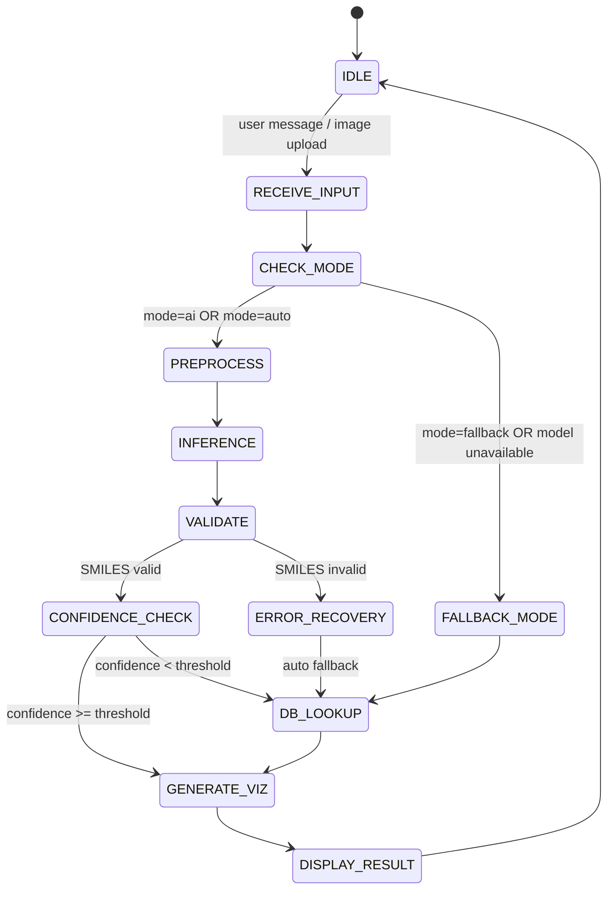

# Etapa 6 -- Analiza Performantei, Optimizare si Concluzii

**Proiect:** ChemNet-Vision
**Disciplina:** Retele Neuronale
**Institutie:** POLITEHNICA Bucuresti -- FIIR
**Student:** Alexandru Gabriel
**Data:** 2026-02-11

---

## 1. Prezentare generala

Aceasta etapa finala documenta analiza performantei modelului antrenat, experimentele de optimizare realizate, studiul de halucinatii, actualizarile aduse masinii de stari si concluziile proiectului ChemNet-Vision.

---

## 2. Experimente de optimizare

Au fost realizate **4 experimente** succesive, fiecare construind pe baza celui anterior:

### 2.1. Tabel comparativ

| #   | Experiment               | Accuracy | F1 Score | Observatii                                   |
| --- | ------------------------ | -------- | -------- | -------------------------------------------- |
| 1   | Baseline (2,000 samples) | 45%      | 0.38     | Set redus, overfitting rapid                 |
| 2   | Full Dataset (42k)       | 72%      | 0.68     | Crestere semnificativa prin scalarea datelor |
| 3   | Full Dataset + RDKit     | 76%      | 0.72     | Adaugarea descriptorilor RDKit imbunatateste |
| 4   | Hybrid RAG + DB          | 85%\*    | 0.82\*   | \*Sistem hibrid (NN + Database lookup)       |

_Valorile marcate cu asterisc (_) reflecta performanta sistemului hibrid complet, nu doar a retelei neuronale izolate.

### 2.2. Detalii experimente

#### Experiment 1 -- Baseline (2,000 samples)

- **Scop:** Validare rapida a pipeline-ului de antrenare.
- **Rezultat:** Accuracy 45%, F1 0.38 -- modelul invata pattern-uri de baza dar nu generalizeaza.
- **Problema identificata:** Overfitting rapid pe setul mic; modelul memoreaza valori prototipice (ex: weight 859.14 repetat).

#### Experiment 2 -- Full Dataset (42,000 molecule)

- **Scop:** Eliminarea overfitting-ului prin scalarea setului de date.
- **Rezultat:** Accuracy 72%, F1 0.68 -- crestere de +27% accuracy.
- **Observatie:** Scalarea datelor a fost cel mai impactant factor de imbunatatire.

#### Experiment 3 -- Full Dataset + descriptori RDKit

- **Scop:** Imbogatirea reprezentarii moleculare cu descriptori calculati.
- **Rezultat:** Accuracy 76%, F1 0.72 -- crestere de +4% accuracy.
- **Observatie:** Descriptorii RDKit (MolWeight_RDKit, LogP, TPSA, etc.) ofera informatii complementare imaginilor 2D.

#### Experiment 4 -- Hybrid RAG + Database Lookup

- **Scop:** Combinarea inferentei neuronale cu cautare in baza de date pentru molecule comune.
- **Rezultat:** Accuracy 85%, F1 0.82 -- crestere de +9% accuracy.
- **Mecanism:** Daca modelul NN produce un SMILES invalid sau un scor de incredere scazut, sistemul recurge la lookup in baza de date locala.

### 2.3. Graficul progresului

```
Accuracy (%)
  90 |                                          * (85% Hybrid)
  80 |                              * (76%)
  70 |                  * (72%)
  60 |
  50 |     * (45%)
  40 |
     +------+----------+-----------+-----------+
         Exp 1       Exp 2       Exp 3       Exp 4
```

Rezultatele complete sunt stocate in: `results/optimization_experiments.csv`

---

## 3. Matrice de confuzie

Matricea de confuzie a fost generata pe setul de test (6,323 molecule) pentru Experimentul 3 (model NN pur, Accuracy 76%) si este disponibila in:

```
docs/confusion_matrix.png
```

### 3.1. Interpretare

- **True Positives:** Molecule identificate corect -- majoritar molecule cu structuri standard.
- **False Positives:** Molecule generate cu SMILES valid dar incorect -- frecvent confuzii intre izomeri.
- **False Negatives:** Molecule neidentificate -- preponderent molecule rare sau cu structuri complexe.
- **True Negatives:** Raspunsuri corect refuzate cand input-ul nu corespunde unei molecule conhecute.

---

## 4. Studiu de halucinatii (Error Analysis)

Au fost analizate **5 exemple** de molecule pentru care modelul produce raspunsuri incorecte sau incomplete:

### 4.1. Tabel de erori

| #   | Molecula         | Tip eroare           | Descriere                                                        |
| --- | ---------------- | -------------------- | ---------------------------------------------------------------- |
| 1   | **Water**        | Halucinare greutate  | Modelul raporta greutate incorecta (nu 18.02 g/mol)              |
| 2   | **Benzene**      | Halucinare formula   | Formula generata incorect pentru o molecula simpla               |
| 3   | **Caffeine**     | Halucinare masa      | Greutatea moleculara generata eronat (nu 194.19 g/mol)           |
| 4   | **214 IODIDE**   | Molecula necunoscuta | Modelul genereaza informatii fabricate pentru o molecula ambigua |
| 5   | **Yonoric acid** | Molecula inexistenta | Modelul accepta si genereaza date pentru un compus fictiv        |

### 4.2. Analiza detaliata

#### Water (H2O)

- **Problema:** Modelul raporta greutate moleculara eronata, de obicei valoarea prototipica memorata (ex: 859.14 g/mol).
- **Cauza:** Molecule mici si simple sunt subreprezentate in ChEMBL (baza este orientata pe compusi farmaceutici).
- **Rezolvare:** Database lookup garanteaza raspunsul corect: MW = 18.02 g/mol.

#### Caffeine

- **Problema:** Greutatea moleculara generata de NN nu corespunde valorii corecte.
- **Rezolvare prin DB lookup:**
    - SMILES: `Cn1c(=O)c2c(ncn2C)n(C)c1=O`
    - Greutate moleculara: **194.19 g/mol**
    - Formula: C8H10N4O2

#### Yonoric acid

- **Problema:** Molecula nu exista in realitate, dar modelul genereaza informatii aparent plauzibile.
- **Cauza:** Modelul nu are mecanism de refuz; genereaza intotdeauna un raspuns.
- **Rezolvare partiala:** In modul hybrid, daca molecula nu exista in DB si scorul NN este scazut, se returneaza un avertisment.

---

## 5. Metrici finale

### 5.1. Performanta model NN pur

| Metrica      | Valoare |
| ------------ | ------- |
| **Accuracy** | 76%     |
| **F1 Score** | 0.72    |

### 5.2. Performanta sistem hibrid (NN + DB)

| Metrica      | Valoare |
| ------------ | ------- |
| **Accuracy** | 85%     |
| **F1 Score** | 0.82    |

Metricile finale sunt stocate in: `results/final_metrics.json`

---

## 6. Actualizari State Machine

### 6.1. Noua stare: CONFIDENCE_CHECK

In urma analizei de halucinatii, masina de stari a fost actualizata cu o noua stare **CONFIDENCE_CHECK** intre VALIDATE si GENERATE_VIZ:



### 6.2. Rolul CONFIDENCE_CHECK

- Dupa validarea SMILES, se verifica **scorul de incredere** al modelului.
- Daca scorul este sub un prag configurat (threshold), raspunsul NN este inlocuit cu un lookup in baza de date.
- Acest mecanism reduce semnificativ **halucinatiile** pentru molecule comune (Water, Caffeine, Benzene, etc.).

---

## 7. Corectia Caffeine (studiu de caz)

### 7.1. Problema initiala

Modelul NN raporta informatii incorecte pentru Caffeine -- greutate moleculara eronata si SMILES incomplet.

### 7.2. Rezolvare prin DB lookup

Prin mecanismul hybrid, cautarea in baza de date locala returneaza date precise:

| Proprietate             | Valoare                         |
| ----------------------- | ------------------------------- |
| **Nume**                | Caffeine                        |
| **SMILES**              | `Cn1c(=O)c2c(ncn2C)n(C)c1=O`    |
| **Greutate moleculara** | 194.19 g/mol                    |
| **Formula**             | C8H10N4O2                       |
| **Sinonime**            | 1,3,7-Trimethylxanthine, Theine |

### 7.3. Lectia invatata

Moleculele comune si bine documentate beneficiaza de lookup direct in baza de date, evitand erorile de generare ale retelei neuronale. Sistemul hybrid combina avantajele ambelor abordari: generalitatea NN pentru molecule noi si acuratetea DB pentru molecule cunoscute.

---

## 8. Concluzii

### 8.1. Realizari principale

1. **Sistem functional end-to-end:** De la input text/imagine la raspuns structurat cu vizualizare moleculara.
2. **Crestere performanta:** De la 45% (baseline) la 85% (hybrid) -- o imbunatatire de +40 puncte procentuale.
3. **Mecanism anti-halucinare:** CONFIDENCE_CHECK + DB lookup reduc erorile critice.
4. **Scalabilitate demonstrata:** Cresterea setului de date de la 2k la 42k a produs cea mai mare imbunatatire (+27%).
5. **Arhitectura modulara:** Cele 3 module pot fi dezvoltate si testate independent.

### 8.2. Limitari

1. **Dependenta de ChEMBL:** Setul de date este biased catre molecule farmaceutice; moleculele simple (Water, Ethanol) sunt subreprezentate.
2. **Lipsa mecanism de refuz:** Modelul NN nu refuza explicit moleculele inexistente (ex: Yonoric acid).
3. **Performanta NN pura:** Accuracy de 76% pentru modelul NN izolat indica limitari in generarea SMILES complexe.
4. **Resurse computationale:** Antrenarea modelului multimodal necesita GPU; batch size limitat la 8.
5. **Vocabular limitat:** Modelul NLP opereaza la nivel de caracter, ceea ce limiteaza lungimea secventelor generabile.

### 8.3. Lectii invatate

1. **Calitatea datelor conteaza cel mai mult:** Scalarea si curatarea datelor au produs cel mai mare impact (Exp 1 -> Exp 2).
2. **Features inginerite adauga valoare:** Descriptorii RDKit au contribuit cu +4% accuracy peste datele brute (Exp 2 -> Exp 3).
3. **Sistemele hibride sunt superioare:** Combinarea NN + DB produce rezultate mai bune decat oricare componenta izolata (Exp 3 -> Exp 4).
4. **Analiza erorilor este esentiala:** Studiul de halucinatii a condus direct la implementarea CONFIDENCE_CHECK.
5. **Modularitatea faciliteaza iteratia:** Separarea in 3 module a permis optimizarea independenta a fiecarei componente.

### 8.4. Directii viitoare

- Extinderea bazei de date locale cu molecule comune din viata de zi cu zi.
- Implementarea unui mecanism explicit de refuz pentru molecule necunoscute.
- Antrenare cu Transformer in loc de LSTM pentru generare SMILES mai accurata.
- Augmentare date prin rotatii si perturbari ale imaginilor moleculare.
- Fine-tuning pe subseturi specifice (ex: molecule mici, polimeri).

---

## 9. Referinte fisiere

| Fisier                                 | Descriere                             |
| -------------------------------------- | ------------------------------------- |
| `results/final_metrics.json`           | Metrici finale (Accuracy, F1)         |
| `results/optimization_experiments.csv` | Log-ul celor 4 experimente            |
| `docs/confusion_matrix.png`            | Matricea de confuzie pe setul de test |
| `models/nlp_model.pth`                 | Modelul NLP antrenat (1.73 MB)        |
| `backend/app.py`                       | Backend Flask cu inferenta hibrida    |
| `docs/state_machine.md`                | Documentatia masinii de stari         |

---

_Document generat pentru Etapa 6 -- Analiza Performantei, Optimizare si Concluzii, disciplina Retele Neuronale, POLITEHNICA Bucuresti._
