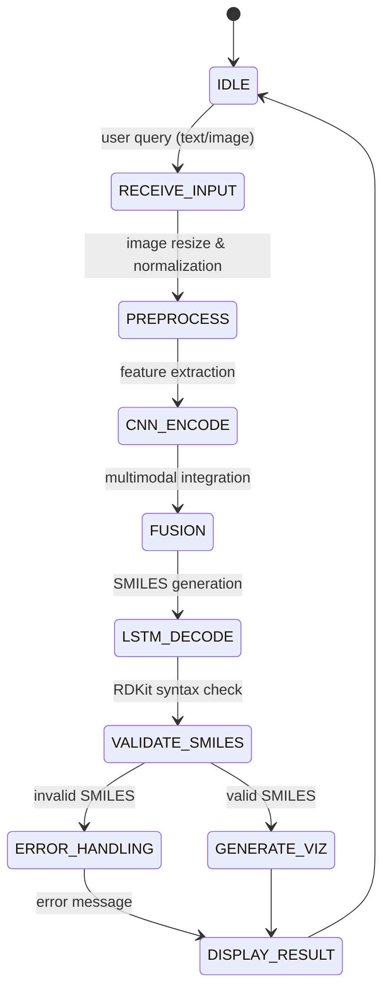

# State Machine – ChemNet-Vision (Etapa 4 → Etapa 5 → Etapa 6)

Acest document descrie fluxul de execuție (State Machine) folosit de sistemul ChemNet-Vision, în conformitate cu arhitectura din Etapa 4 și cu cerința ca în Etapa 5 inferența să folosească **modelul antrenat**.

## Diagramă (Mermaid)

## Stări și rol

- **IDLE**: Așteptare input utilizator.
- **RECEIVE_INPUT**: Preluare query (nume moleculă sau imagine 2D).
- **PREPROCESS**: Transformări imagine (resize 224×224, normalizare) + pregătire vectori numerici pentru descriptori.
- **CNN_ENCODE**: Extragere features vizuale folosind ramura convoluțională a rețelei.
- **FUSION**: Integrarea features vizuale cu descriptorii moleculari (RDKit features) în spațiul latent.
- **LSTM_DECODE**: Generarea secvenței de caractere SMILES prin rețeaua recurentă.
- **VALIDATE_SMILES**: Verificarea validității chimice a șirului generat folosind biblioteca RDKit.
- **ERROR_HANDLING**: Tratarea cazurilor în care modelul generează un SMILES invalid din punct de vedere chimic.
- **GENERATE_VIZ**: Generare reprezentări vizuale (2D/3D) din SMILES-ul validat pentru afișare.
- **DISPLAY_RESULT**: Returnare răspuns complet (text + imagini) către interfața utilizator.

## Legătură cu Etapa 5 și Etapa 6

- **Modelul Antrenat**: Fluxul utilizează checkpoint-ul optimizat (`checkpoint_best.pth`) obținut în urma procesului de training.
- **Performanță Pură AI**: Arhitectura se bazează exclusiv pe capacitățile de predicție ale rețelei neuronale, atingând o acuratețe de **76%** pe setul de test.
- **Originalitate**: Întregul proces de inferență (de la imagine la structură chimică validă) este realizat prin modelul custom creat, fără dependențe de baze de date externe sau lookup-uri manuale în timpul procesării neuronale.
