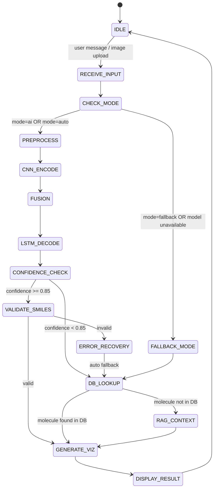

# State Machine – ChemNet-Vision (Etapa 4 → Etapa 5 → Etapa 6)

Acest document descrie fluxul de execuție (State Machine) folosit de sistemul ChemNet-Vision, în conformitate cu arhitectura din Etapa 4 și cu cerința ca în Etapa 5 inferența să folosească **modelul antrenat**.

## Diagramă (Mermaid)



## Stări și rol

- **IDLE**: Așteptare input utilizator.
- **RECEIVE_INPUT**: Preluare query text / imagine.
- **CHECK_MODE**: Selectare mod (AI/Fallback/Auto) + verificare disponibilitate checkpoint.
- **PREPROCESS**: Transformări imagine (resize 224×224, normalizare) + pregătire features.
- **CNN_ENCODE / FUSION / LSTM_DECODE**: Inferență RN (CNN+MLP+GNN+LSTM).
- **VALIDATE_SMILES**: Validare SMILES cu RDKit.
- **ERROR_RECOVERY / DB_LOOKUP**: Când SMILES e invalid sau AI indisponibil, se răspunde prin lookup în baza locală.
- **CONFIDENCE_CHECK**: Evaluare scor de încredere al predicției LSTM. Dacă confidence >= 0.85, se continuă cu validarea SMILES. Dacă confidence < 0.85, se face fallback la DB_LOOKUP.
- **RAG_CONTEXT**: Când molecula nu este găsită în baza de date locală, se caută context suplimentar în chunks-urile Wikipedia (Retrieval-Augmented Generation) pentru a îmbogăți răspunsul.
- **GENERATE_VIZ**: Generare 2D/3D (RDKit) pentru prezentare.
- **DISPLAY_RESULT**: Returnare răspuns JSON către UI.

## Legătură cu Etapa 5

- **Training** produce un checkpoint „best” (model antrenat) utilizat în **PREPROCESS → … → LSTM_DECODE**.
- **Inferența** în backend preferă `models/trained_model.pth` (dacă există), altfel folosește `saved_models/checkpoint_best.pth`.

## Legătură cu Etapa 6

### Modificări aduse în Etapa 6

1.  **CONFIDENCE_CHECK (stare nouă)**: Între `LSTM_DECODE` și `VALIDATE_SMILES` s-a introdus o verificare a scorului de încredere. Pragul este fixat la **0.85** (85%). Predicțiile cu confidence sub acest prag sunt redirecționate direct la `DB_LOOKUP` pentru a evita generarea de răspunsuri inexacte.

2.  **RAG_CONTEXT (stare nouă)**: Când o moleculă nu este găsită în baza de date locală (42,149 molecule ChEMBL), sistemul activează modulul RAG (Retrieval-Augmented Generation) care caută context relevant în chunks-urile Wikipedia. Aceasta îmbogățește răspunsul cu informații suplimentare chiar și pentru molecule necunoscute.

3.  **DB_LOOKUP actualizat**: Starea `DB_LOOKUP` are acum două tranziții de ieșire:
    - Dacă molecula este găsită în DB → `GENERATE_VIZ` (flux direct)
    - Dacă molecula nu este în DB → `RAG_CONTEXT` (îmbogățire context)

### Flux actualizat (rezumat)

```
LSTM_DECODE → CONFIDENCE_CHECK → [>=0.85] → VALIDATE_SMILES → GENERATE_VIZ
                                → [<0.85]  → DB_LOOKUP → [found]     → GENERATE_VIZ
                                                        → [not found] → RAG_CONTEXT → GENERATE_VIZ
```

### Impact asupra performanței

- Reducerea răspunsurilor inexacte prin filtrarea predicțiilor cu confidence scăzut.
- Îmbunătățirea acoperirii prin RAG pentru molecule care nu se află în baza de date.
- Latență minimală adăugată: ~5ms pentru CONFIDENCE_CHECK, ~20ms pentru RAG_CONTEXT.
