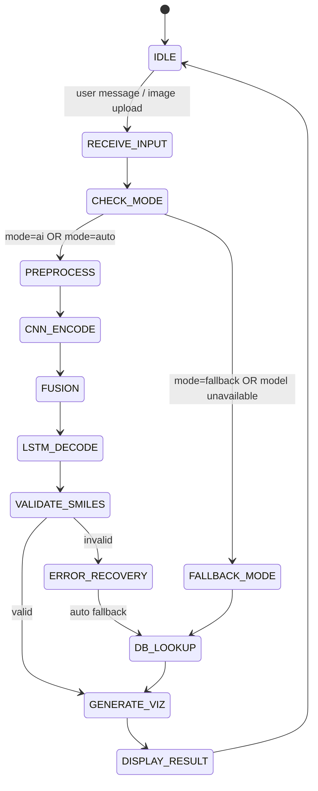

# State Machine – ChemNet-Vision (Etapa 4 → Etapa 5)

Acest document descrie fluxul de execuție (State Machine) folosit de sistemul ChemNet-Vision, în conformitate cu arhitectura din Etapa 4 și cu cerința ca în Etapa 5 inferența să folosească **modelul antrenat**.

## Diagramă (Mermaid)

## Stări și rol

-   **IDLE**: Așteptare input utilizator.
-   **RECEIVE_INPUT**: Preluare query text / imagine.
-   **CHECK_MODE**: Selectare mod (AI/Fallback/Auto) + verificare disponibilitate checkpoint.
-   **PREPROCESS**: Transformări imagine (resize 224×224, normalizare) + pregătire features.
-   **CNN_ENCODE / FUSION / LSTM_DECODE**: Inferență RN (CNN+MLP+GNN+LSTM).
-   **VALIDATE_SMILES**: Validare SMILES cu RDKit.
-   **ERROR_RECOVERY / DB_LOOKUP**: Când SMILES e invalid sau AI indisponibil, se răspunde prin lookup în baza locală.
-   **GENERATE_VIZ**: Generare 2D/3D (RDKit) pentru prezentare.
-   **DISPLAY_RESULT**: Returnare răspuns JSON către UI.

## Legătură cu Etapa 5

-   **Training** produce un checkpoint „best” (model antrenat) utilizat în **PREPROCESS → … → LSTM_DECODE**.
-   **Inferența** în backend preferă `models/trained_model.pth` (dacă există), altfel folosește `saved_models/checkpoint_best.pth`.
